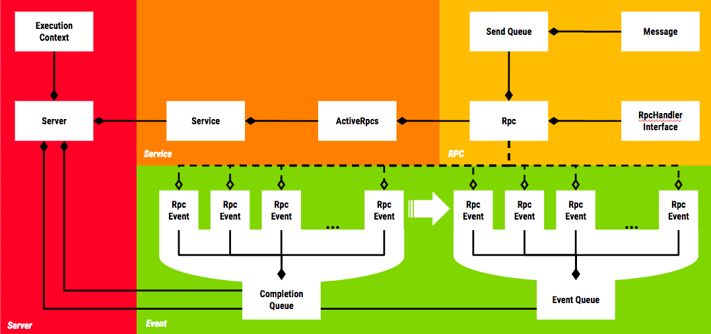

<div style="text-align:center"></div>

# Tiny C++ gRPC Server Framework

## Objective
<a name="objective"></a>

This repository contains a C++ gRPC framework for building asynchronous, multi-threaded gRPC servers.
The framework is simple to use and supports arbitrary RPC types, i.e. all combinations of streaming and unary requests and responses.

## Motivation
<a name="motivation"></a>

[gRPC](https://grpc.io/docs/guides/) is Google's open source RPC system which relies on [Protobuf](https://developers.google.com/protocol-buffers/)  as a message serialization format.
 
gRPC makes it convenient through its protobuf compiler plugin to implement _synchronous_ servers.
For Cartographer, sensor data (IMU, odometry, fixed-frame poses) and intermediate local SLAM results need to be continuously streamed to the cloud Cartographer instance.
Strict time ordering is only required for sensor data of the same type.
Therefore it is natural to have up to 4 client-streaming RPC connections concurrently open per mapping client.
With a server handling requests synchronously even for small robot fleets this would quickly result in unnaturally many threads.

A good way to solve this problem is to handle RPC connections asynchronously on the server where a fixed number of worker threads processes RPC event queues.
Fortunately gRPC offers a way to asynchronously schedule RPC actions, e.g. RequestAsyncRead(), and also an event queue mechanism to wait for the completion of these events, e.g. ::grpc::CompletionQueue.

So we built a small server framework on top of the existing gRPC async mechanisms to make it convenient to write asynchronous gRPC servers.

## Usage

### Example: Server offering unary RPC method “GetSquare()”

We start by defining the gRPC service as a proto service definition:

```proto
syntax = "proto3";

package proto;

message GetSquareRequest {
  int32 input = 1;
}

message GetSquareResponse {
  int32 output = 1;
}

service Math {
  rpc GetSquare(GetSquareRequest) returns (GetSquareResponse);
}
```

Note that the above defines an RPC that expects a unary request and generates a unary response from the server.
For streaming RPCs the request or response type would have been prepended with a `stream` annotation (see next example).

Next we define an implementation of the business logic that consumes the request and generates the response, i.e. the RPC handler.

```C++
DEFINE_HANDLER_SIGNATURE(
    GetSquareSignature, proto::GetSquareRequest, proto::GetSquareResponse,
    "/proto.Math/GetSquare")

class GetSquareHandler : public RpcHandler<GetSquareSignature> {
 public:
  void OnRequest(const proto::GetSquareRequest& request) override {
    auto response =
        cartographer::common::make_unique<proto::GetSquareResponse>();
    response->set_output(request.input() * request.input());
    Send(std::move(response));
  }
};
```

When a client establishes a connection to the server to call the `GetSquare` method, a new instance of a `GetSquareHandler` is instantiated.
The lifetime of each handler is therefore request scoped.
The `OnRequest()` method is invoked with the deserialized client request and the handler now has a chance to react to the request.
In this case we perform the calculation, populate a `GetSquareResponse` proto and pass it to the `Send()` method to be shipped to the client.
Note that for unary response RPCs calling `Send()` finishes the connection with `::grpc::Status::Ok`.
Note that we could have decided to call also call e.g. Finish(`PERMISSION_DENIED`) to error out instead of providing a response.

Next we set up the server and register our message handler.

```C++
Server::Builder server_builder;
server_builder.SetServerAddress("localhost:50051");
server_builder.SetNumGrpcThreads(2);
server_builder.SetNumEventThreads(2);
server_builder.RegisterHandler<GetSquareHandler>();
auto server = server_builder.Build();
server.Start();
server.WaitForShutdown();
```

The server address sets the interfaces and port on which the server will offer the gRPC service.
Number of gRPC threads specifies the number of threads the server will use for running the network stack and performing proto serialization / deserialization.
Number of event threads determines the number of threads running the business logic, i.e. the `GetSquareHandler` implemented above.

Note that there is no guarantee on which thread the handler will be created, but once the handler has been created it will always executed for the lifetime of the exchange on the same thread.
There is therfore no requirement for the `GetSquareHandler` to be thread-safe.

## Overview
<a name="overview"></a>

<div style="text-align:center"></div>

<div style="text-align:center">Figure 1: gRPC framework architecture overview.</div>

The above class diagram provides an overview of the most important concepts in the framework.
Let's look at these in turn.


### Server
<a name="server"></a>

The `Server` class owns all server-wide resources, such as the gRPC completion queues, all event queues and the threads that process these queues (see [Threading Model](#threading-model) section below for more details).
In addition to that the server may own an implementation of `ExecutionContext` which provides shared state that can be accessed by `RpcHandlers` in a thread-safe manner (see [here](#example-sharing-resources-across-handler-invocations) for example).

The `Server` also maintains a mapping from (service name, method name) to `RpcHandler` implementations. When the server is started it creates the `Service` objects as needed for the registered methods and passes the mappings to the `RpcHandler`s to the `Service`s so that they can instantiate the appropriate handlers when requests are issued against their methods.

`Server`s are set up using a builder pattern. A `ServerBuilder` is used to specify server properties such as the serving network address or the number of threads to use for completion and event queues.


#### Threading Model
<a name="threading-model"></a>

The gRPC framework relies on two sets of threads for execution.
There are a configurable number of gRPC completion queue threads.
These threads carry out any network activity through libgrpc and also perform protobuf serialization / deserialization.

The event threads actually run the business logic, i.e. they execute the `RpcHandler`s.
Note that the framework guarantees that for a given RPC method invocation all events are always processed by the same completion queue and the same event queue.
For a given `Rpc` object everything looks single-threaded.

Most events originate in libgrpc by an `Rpc` object requesting an asynchronous operation such as `::grpc::Service::RequestAsyncClientStreaming`.
These events eventually show up on their gRPC completion queue and are processed by a completion queue thread.
The thread then advances these events to the appropriate event thread, where they are further processed, e.g. the appropriate handler is invoked to perform some action in response to the event.

### Service
<a name="service"></a>

The `Service` objects represent gRPC services and are actually implementations of `::grpc::Service`.
Their job is to route the events that bubble up from the `Server` to the appropriate `Rpc` objects for processing.
The `Service` therefore maintains a mapping from its RPC method names to the `RpcHandlerInfo` objects to be able to instantiate handlers when requests are issued against its methods.
In addition to that it also manages the lifetime of the `Rpc` objects which represent a client connection for a specific RPC method invocation.
The `ActiveRpcs` object owned by the services is responsible for that. An `EventQueueSelector` is used to select an event queue for incoming requests.
By default we simply assign them in a round-robin fashion.


### Rpc
<a name="rpc"></a>

An `Rpc` represents a connection from a particular client for a specific method invocations.
One client invoking two different methods on the same server is therefore represented by two `Rpc` objects.
`N * M` `Rpc` objects are created when the server is started waiting for incoming client connections, where `N` is the number of completion queues and `M` is the total number of methods offered by the server across all services.
When a client invokes a method, the connection is randomly assigned to a completion queue by gRPC.
The `Rpc` object responsible for the method on that particular completion queue is cloned and the new `Rpc` object starts listening for new connections while the old one takes care of any interaction with the client and dies when the method invocation is finished by either client or server.

### RpcHandlerInterface
<a name="rpchandlerinterface"></a>

`RpcHandlerInterface` is the low-level interface implemented by handlers and used by the `Rpc` object, responsible for the connection to the client, to interact with the handler.
It is not user-facing. Rather users implement the derived template class `RpcHandler<Incoming, Outgoing>`, where `Incoming` specifies the incoming and `Outgoing` the outgoing message type.
In order to allow users to express that the handler is expecting a stream of requests or responses rather than a single one, we use the templated type `Stream` to wrap the raw message type.
A handler implementation of `RpcHandler<Stream<A>, B>`expects a stream of `A`-typed requests and replies with a single response of type `B` (see also [examples below](#example-server-offering-streaming-request-rpc-method-"getsum-")).


#### Response Generation On Different Thread
<a name="response-generation-on-different-thread"></a>

For server-streaming (`RpcHandler<?, Stream<?>>`) RPCs it can be convenient to perform the response message generation on a thread other than the handler thread.
For Cartographer we had this situation for streaming local SLAM results to the client: the event of a new local SLAM result becoming available occurs on our SLAM thread and not the handler thread.

So rather than having the user of our framework create a synchronization mechanism between the two threads we built such a mechanism into the framework.
A call to `RpcHandler<?, ?>::GetWriter()` returns a thread-safe `Writer` object that can be used to enqueue messages into the`Rpc` send queue and notifies the handler thread that it should process that queue.
It is always safe to call the `Writer` from any thread even as the connection is being closing (`Writer::write()` will return `false` in that case) as the `Writer` only weakly points to the `Rpc` object.

### RpcEvent
<a name="rpcevent"></a>

`RpcEvent`s are used to propagate information from libgrpc to and through our framework.
libgrpc uses tagging of asynchronous operations with `void*` pointers as a way to associate events on the completion queues with the operations that they represent.
We tag our async gRPC ops with pointers to `RpcEvent`s which contain enough metadata for `Server` and `Service` to be able to route them to their appropriate `Rpc` objects, where they are acted upon.
Most `RpcEvent`s first show up in the completion queue when their corresponding network activity completes and are then advanced to the appropriate event queues for handler invocation.
An exception is the `WRITE_NEEDED` event issued by the `Writer` objects mentioned above which only weakly point to their `Rpc` object and are directly injected into the event queue bypassing the completion queue altogether.

### Client
<a name="client"></a>

`Client` is a templated convenience class to make synchronous invocations of RPC methods on remote services simple.
It offers a uniform interface for all RPC types (i.e. unary, cient-streaming, server-streaming, bidi-streaming).
The `Client` is instantiated with the implementation of the `RpcHandlerInterface` of the method to be invoked as the template parameter.
It relies on the `RpcHandlerInterface::method_name() `method to extract the fully qualified gRPC method name.
The `Client` is constructed with a `::grpc::Channel` that is bound to the server hosting the service.
Optionally a `RetryStrategy` can be passed to make the `Client` retry failed invocation attempts.


### RetryStrategy
<a name="retrystrategy"></a>

A `RetryStrategy` is passed to a `Client` to retry failed invocation attempts.
Retries are only supported for unary RPCs.
The only `RetryStrategy` implemented at the moment is the `LimitedBackoffStrategy` which takes `min_delay`, `backoff_factor` and `max_attempts` as parameters.

Example:

```
min_delay = 100ms
backoff_factor = 2
max_attempts = 5
```
would retry after 100ms, 200ms, 400ms and 800ms and then give up.


### RpcHandlerTestServer
<a name="rpchandlertestserver"></a>

Since all side-effects (that extend beyond the lifetime of an RPC) a`RpcHandler` can cause must happen through the `ExecutionContext`, it is desirable to test handlers by mocking the `ExecutionContext`, throw some gRPC requests at the handler and expect certain call invocations on the `ExecutionContext`.
In practice this is however slightly complicated by the fact that all `RpcHandler` executions are asynchronously.

The `RpcHandlerTestServer` is a convenient way to test `RpcHandler`s.
It is instantiated with the handler-under-test as a template parameter and automatically starts a new `Server` with only that `RpcHandler` registered.
The methods `SendWrite()`, `SendWritesDone()` and `SendFinish()` can be used to synchronously drive the `RpcHandler` through its lifetime, i.e. when these methods return, all invocations on the `RpcHandler` side are guaranteed to have completed.

The `RpcHandlerTestServer` achieves that by wrapping the handler-under-test in a `RpcHandlerWrapper` and conspires with that wrapper to ensure that it only returns once the `RpcHandler` invocations have completed.
